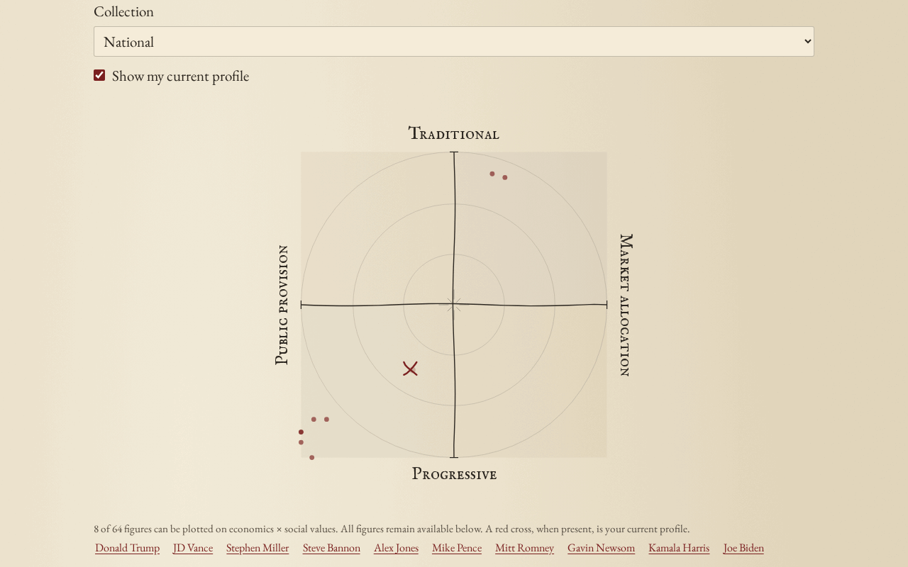

# The Political Atlas



Live: https://political-test-2026.web.app

A political compass for the 2026 US landscape, rendered as an ink-on-paper
manuscript. Most compass tests hand you a dot and no accounting: you can't see
which answers moved you, what "unsure" did, or where a public figure's position
on the same chart came from. This one keeps the receipts. Every figure on the
map is scored by answering the same instrument they would, from cited votes,
quotes and actions, and the dossier behind each score is in the repo.

It is an exploratory instrument, not a validated diagnosis. Nothing here is
calibrated against a real population.

## What it does

The core is 30 propositions. Optional chapters cover economics, social and
liberty questions, institutions, building and energy, foreign policy,
technology, and dated current affairs, for 83 propositions in the full bank.
You can answer a proposition, say you're mixed on it, say you're unsure, or
skip it, and those are four different things in the scoring. Importance,
certainty, reasons and private notes are recorded separately from the position
itself.

Results come out as twelve independent dimensions rather than one summary
identity: economics, social values, checks on power, civil liberties, building,
and narrower trust, foreign and technology facets. Pick any two for a map and
export it as a labeled PNG. A dimension needs three stated positions before it
is plotted, so thin coverage shows as thin coverage instead of a confident zero.

Answers and notes stay in browser storage. There is no account. The one thing
that leaves the browser is the optional leaderboard entry, which is a name and
a pair of coordinates written to Firestore under create-only, schema-validated
rules (`firestore.rules`), loaded lazily and only when you open it.

## Figures and evidence

`public/figure-evidence.json` holds 69 figures. Each one has a dossier in
`docs/figures/<slug>.md` with per-question scores, a short quote or action, and
a source URL, produced by parallel research agents following the rules in
`docs/figures/METHOD.md`. Coordinates are never written by hand: a figure's
answers run through `src/scoring.js` like any other respondent. Positions that
are unknown, mixed or inferred are excluded rather than rounded to neutral, and
a comparison needs six shared positions before it will draw.

The review timestamp in that file is not a claim that every source was freshly
reverified. The 27 figures added on 2026-08-11 are first-pass and sit below the
citation density of the original batch; that verification pass is still open in
`docs/roadmap.md`. Dead citations turn up too. See
`docs/evidence-review-2026-09.md` and `docs/election-research-2026-09.md`.

The faction territories in `src/factions.js` are hand-drawn ellipses, not
computed clusters. They are display copy over the same scored figures.

## How the instrument is built

`src/instrument.js` owns the current propositions, their versions and their
explicit loadings on each dimension. All axis math lives in `src/scoring.js`,
and no axis math belongs anywhere else. Each proposition carries dimension tags
and a weight vector, so a new view is a new pair of dimensions rather than new
math. Roughly half the items are reverse-coded to cancel agree-bias.

Old answers migrate where they still mean the same thing. A reworded
proposition gets a new id and asks again, and old neutral or unsure zeros come
back as unsure rather than as a claimed neutral position. Legacy records and the
original browser storage key are left intact.

## How the agent pipeline works

The figure scores came from research agents, not from me typing numbers. What the repo holds:

- `docs/figures/METHOD.md` is the brief every research agent read before scoring: the answer scale, cite-or-zero rule, dossier format and the JSON each agent returned.
- `docs/figures/<slug>.md` are the dossiers those agents wrote. Their answer sets live in `src/figures.js`, `src/figures-bench.js`, `src/figures-media.js`, `src/figures-mn.js` and `src/figure-updates.js`, and `src/scoring.js` turns them into coordinates.
- `docs/figures/analyze.mjs` measures per-question spread, axis correlations and map crowding across figures. Its numbers drove `docs/figures/QUESTION-PROPOSALS.md`; `docs/question-expansion-2026-08.md` lists every generated candidate question with why it was kept or cut. I reviewed bank edits before they shipped.
- Verification was more agent passes against the same rubric: `docs/figures/RECENCY-UPDATE-2026-07-18.md`, `docs/evidence-review-2026-09.md` and `docs/election-evidence-review-2026-09.md`. `docs/changelog.md` records the corrections each pass made.
- `npm test` (45 tests in `src/*.test.js`) is the gate: every figure scored on every researched question, every figure has a dossier, pending items can't move figure scores, and unknown or inferred evidence never gets a number.

Not in the repo: the dispatch prompts and run logs (they lived in my local orchestrator) and whatever script built `public/figure-evidence.json` and `docs/evidence-inventory-counts.json`.

## Running it

```sh
npm ci
npm test      # vitest: scoring and instrument invariants
npm run dev
npm run build
```

Vanilla JavaScript and Vite, no framework. Firebase Hosting, already set up.

## State of the repo

Production was rolled back on 2026-09-06 to the August 1 build after regressions
in the multi-figure charts and save workflows. That build is the 42-question
compass with 42 charted figures, and it is what the live link above serves.
Master carries the Atlas rewrite described above, with the 69-figure evidence
file, and it has not been deployed. So the
live site and this source tree are not the same product right now, and the
roadmap's open item is the deploy decision. `docs/intent.md` is the authority on
that.

The earlier interface is kept at `docs/archive/atlas-v1/main.js` with its
instrument, scoring helpers and tests. `public/release-notes.md` is the visitor
facing description of what changed and what it does not claim.
